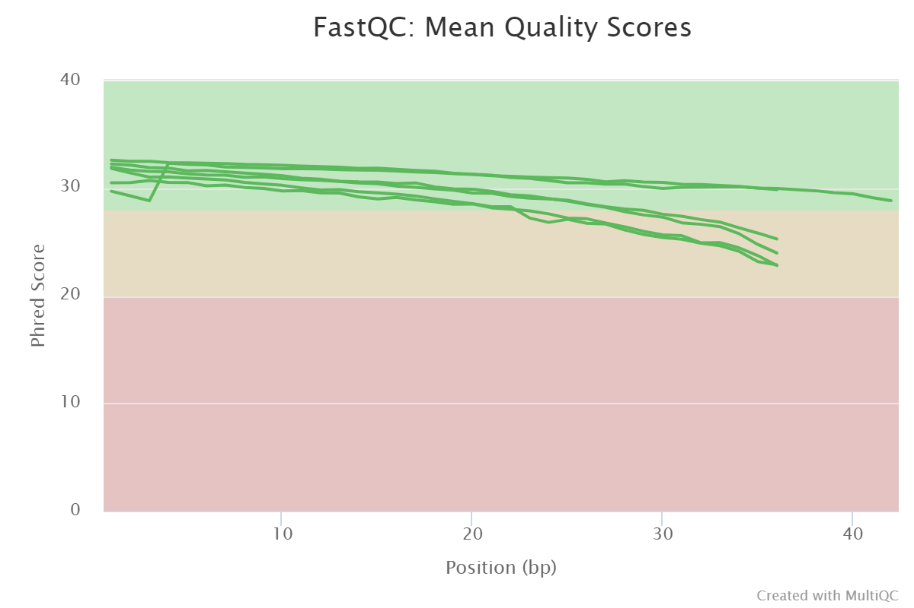
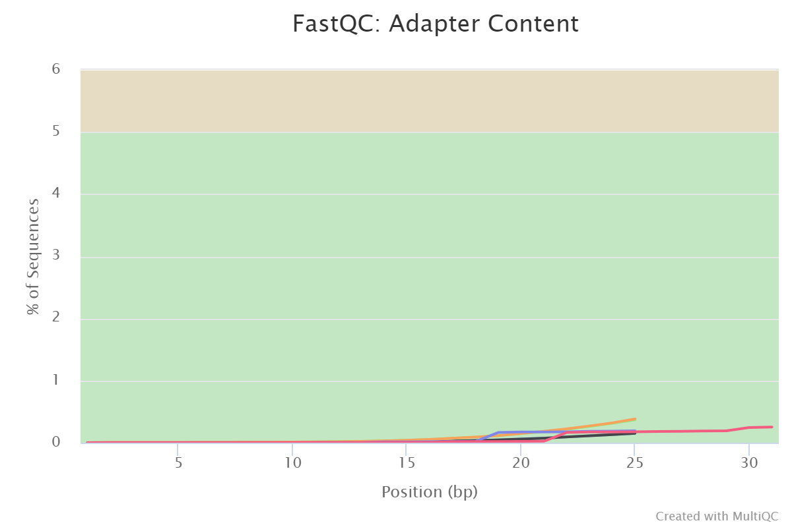

## Detection of single nucleotide polymorphisms in _Saccharomyces cerevisiae_
Author: Anita Brzoza

### Table of contents

  - [Introduction](#introduction)
  - [Data downloading](#data-downloading)
  - [Quality control and filtering](#quality-control-and-filtering)
  - [Mapping to the reference genome](#mapping-to-the-reference-genome)
  - [Detection, filtration and annotation of SNPs](#detection-filtration-and-annotation-of-snps)
  - [Conclusions](#conclusions)
  - [References](#references)

### Introduction

_Saccharomyces cerevisiae_ was the first eukaryote whose genome was sequenced in 1996. Moreover, because of its small genome, it has become a model organism for studying gene function, and a comprehensive knowledge of yeast genetics and biochemistry is important for tracking the molecular processes that cause functional and genetic differences among strains of these microorganisms. The phenotypic variation is defined by many differernt types of variants, starting from single nucleotide polymorphisms (SNPs), insertions or deletions, etc. to large structural changes such as gene copy number variations (CNVs) and chromosomal translocations [(1)](#1-basile-a-de-pascale-f-bianca-f-rossi-a-frizzarin-m-de-bernardini-n--campanaro-s-2021-large-scale-sequencing-and-comparative-analysis-of-oenological-saccharomyces-cerevisiae-strains-supported-by-nanopore-refinement-of-key-genomes-food-microbiology-97-103753-doi101016jfm2021103753). 

In this study, the analysis will focus on the detection of single nucleotide polymorphisms in vac6 (wild type and mutant with impaired vacuole inheritance) and vac22 (wild type) _Saccharomyces cerevisiae_ strains. The data used are from the SRA study number [SRP003355](https://trace.ncbi.nlm.nih.gov/Traces/sra/?study=SRP003355) published on 2010-10-12 in the [National Center for Biotechnology Information Sequence Read Archive](https://www.ncbi.nlm.nih.gov/sra/) [(2)](#2-birkeland-s-r-jin-n-ozdemir-a-c-lyons-r-h-jr-weisman-l-s-wilson-t-e-2010-discovery-of-mutations-in-saccharomyces-cerevisiae-by-pooled-linkage-analysis-and-whole-genome-sequencing-genetics-1864-11271137-doiorg101534genetics110123232).

[Back to table of contents](#table-of-contents).

### Data downloading 

The first step was to download raw paired-end sequences assigned to SRA study number SRP003355. To do this, the identification numbers of the data files containing the raw sequences were retrieved by creating accession lists using the functions available in [Entrez Direct](https://www.ncbi.nlm.nih.gov/books/NBK179288/) (using commands such as: 1) esearch - to find the SRA study, 2) efetch - to display the resulting data in xml format, 3) xtract - to extract the run numbers). Then the first 1,000,000 sequences from each run were  downloaded using fastq-dump (version 2.11.0) from [SRA tools](https://github.com/ncbi/sra-tools/wiki) and the reads were separated into separate files. 

The code used for this step of the analysis can be found in the [src](src/) directory as [data_downloading.sh](src/data_downloading.sh).

The table below shows which organism is included in the sample.

| Run ID | _S. cerevisiae_ strain |
| :--- | :--- | 
| SRR064545 | vac6 wild type |
| SRR064546 | vac6 mutant |
| SRR064547 | vac22 wild type |

[Back to table of contents](#table-of-contents).

### Quality control and filtering

In the next step, quality control of the extracted sequences was done using [FastQC](https://www.bioinformatics.babraham.ac.uk/projects/fastqc/) (version 0.11.9). A summary report of the obtained results was also prepared using [MultiQC](https://multiqc.info/) (version 1.12), which in [data](data/) directory as [multiqc-report1.html](data/multiqc_report1.html). 

The sequences obtained were from Illumina 1.9 sequencing, with read lengths of 36 bp (the exception being reverse reads of the wild-type _S. cerevisiae_ vac22 strain, which were 42 bp long). The percentage of GC pairs in the _S. cerevisiae_ vac6 strain was 39%, while in the vac22 strain it was 40-41%. The lowest mean sequence quality per base was about 22 and the highest about 32. Reads for the vac6 strain showed lower mean read quality than for the vac22 strain. The chart of average quality of readings per base is shown below. 

The highest sequence quality recorded was 34 (for 4 reads from file SRR064547_1) and the lowest was 0 (for 60 reads from file SRR064547_2 and 1,357 reads from file SRR064546_2).

Quality control also noted the presence of Illumina Universal Adaptors, as shown in the graph below. The adapters appeared in samples SRR064545_1, SRR064546_2, SRR064547_1, and SRR064547_2.

Given the above information, only the adapter sequences were removed using [Trimmomatic](http://www.usadellab.org/cms/?page=trimmomatic) (version 0.39) because the average quality of the sequences was satisfactory. A summary quality report after filtering can be found in [data](data/) directory as [multiqc-report2.html](data/multiqc_report2.html). 

The code used for this step of the analysis can be found in the [src](src/) directory as 1) [quality_control.sh](src/quality_control.sh) and 2) [filtering.sh](src/filtering.sh).

[Back to table of contents](#table-of-contents).

### Mapping to the reference genome

The reference genome with annotation (version R64) was downloaded from the [National Center for Biotechnology Information Genome](https://www.ncbi.nlm.nih.gov/genome/?term=Saccharomyces%20cerevisiae). 

Next, using [bowtie2](http://bowtie-bio.sourceforge.net/bowtie2/index.shtml) (version 2.3.5.1) the reference genome index was created and then the sequences from the samples were mapped to the reference genome, creating BAM files at once using [SAMTOOLS](http://www.htslib.org/) (version 1.10). A summary of the mapping is shown in the table below.

|  | SRR064545 | SRR064546 | SRR064547 |
| :--- | :--- | :--- | :---|
| Reads | 996558 | 992531 | 999937 |
| Paired reads | 996558 (100%) | 992531 (100%) | 999937 (100%) |
| Reads aligned concordantly 0 times | 317985 (31.91%) | 619071 (62.37%) | 988404 (98.85%) |
| Reads aligned concordantly exactly 1 time | 584576 (58.66%) | 305931 (30.82%) | 9230 (0.92%) |
| Reads aligned concordantly >1 times | 93997 (9.43%) | 67529 (6.80%) | 2303 (0.23%) |
| | | | |
| Pairs aligned concordantly 0 times | 317985 | 619071 | 988404 |
| Pairs aligned discordantly 1 time | 160537 (50.49%) | 318043 (51.37%) | 558299 (56.48%) |
| | | | |
| Pairs aligned 0 times concordantly or discordantly | 157448 | 301028 | 430105 |
| Mates make up the pairs | 314896 | 602056 | 860210 |
| Mates make up the pairs aligned 0 times | 126907 (40.30%) | 201062 (33.40%) | 318600 (37.04%) |
| Mates make up the pairs aligned exactly 1 time | 97826 (31.07%) | 174937 (29.06%) | 234035 (27.21%) |
| Mates make up the pairs aligned >1 times | 90163 (17.63%) | 226057 (37.55%) | 307575 (35.76%) |
| | | | |
| Overall alignment rate | 93.63% | 89.87% | 84.07%|

In the next step, bam files were improved. To do it, bam files were sorted using [SAMTOOLS](http://www.htslib.org/), reads were added to individual read-groups, and duplicates were marked using Picard (version 2.27.1, available from [The Genome Analysis Toolkit (GATK)](https://gatk.broadinstitute.org/hc/en-us) version 4.2.6.1), then bam files were indexed and read depth was calculated for each bam file using [SAMTOOLS](http://www.htslib.org/). The output files can be found in [data](data/) directory as [SRR064545_coverage.txt](data/SRR064545_coverage.txt), [SRR064546_coverage.txt](data/SRR064546_coverage.txt) and [SRR064547_coverage.txt](data/SRR064547_coverage.txt).

The code used for this step of the analysis can be found in the [src](src/) directory as 1) [downloading_reference_genome.sh](src/downloading_reference_genome.sh), 2) [mapping_to_reference.sh](src/mapping_to_reference.sh), 3) [improving_bam_files.sh](src/improving_bam_files.sh).

[Back to table of contents](#table-of-contents).

### Detection, filtration and annotation of SNPs

First, a reference genome file was prepared by creating the FASTA sequence dictionary file using [GATK]((https://gatk.broadinstitute.org/hc/en-us)) and creating fasta index file using [SAMTOOLS](http://www.htslib.org/). 

Then using GATK polymorphisms were detected, VCF files were merged into one and genotyped. Only single nucleotide polymorphisms were selected. The output CVF file can be found in [data](data/) directory as [SNP.vcf](data/SNP.vcf). 6311 SNPs Variants were detected.

In the next step, annotation was added to the vcf file using the [bioinfokit library](https://github.com/reneshbedre/bioinfokit) (version 2.0.8) for python 3.8.6. 

The file was then filtered to get rid of variants with an overall quality of less than 30 and a depth of less than 10 - using [SnpSift](http://pcingola.github.io/SnpEff/) (version 5.1d). 3113 variants were received. In the next step, using the R (version 4.1.3) variants were filtered from positions characterized by a lack of information regarding the location in the genome and a lack of inforamation regarding the transcript ID.

The code used for this step of the analysis can be found in the [src](src/) directory as 1) [preparing_reference_genome.sh](src/preparing_reference_genome.sh), 2) [detecting_snp.sh](src/detecting_snp.sh), 3) [annotating.py](src/annotating.py) 4) [filtering_SNP.sh](src/filtering_SNP.sh) and [R_filtering_SNP.R](src/R_filtering_SNP.R).

[Back to table of contents](#table-of-contents).

### Conclusions

[Back to table of contents](#table-of-contents).

### References

###### [1] Basile, A., De Pascale, F., Bianca, F., Rossi, A., Frizzarin, M., De Bernardini, N., … Campanaro, S. (2021). Large-scale sequencing and comparative analysis of oenological Saccharomyces cerevisiae strains supported by nanopore refinement of key genomes. Food Microbiology, 97, 103753. doi:10.1016/j.fm.2021.103753 

###### [2] Birkeland, S. R., Jin, N., Ozdemir, A. C., Lyons, R. H., Jr, Weisman, L. S., Wilson, T. E. (2010). Discovery of mutations in Saccharomyces cerevisiae by pooled linkage analysis and whole-genome sequencing. Genetics, 186(4), 1127–1137. doi.org/10.1534/genetics.110.123232

[Back to table of contents](#table-of-contents). 
